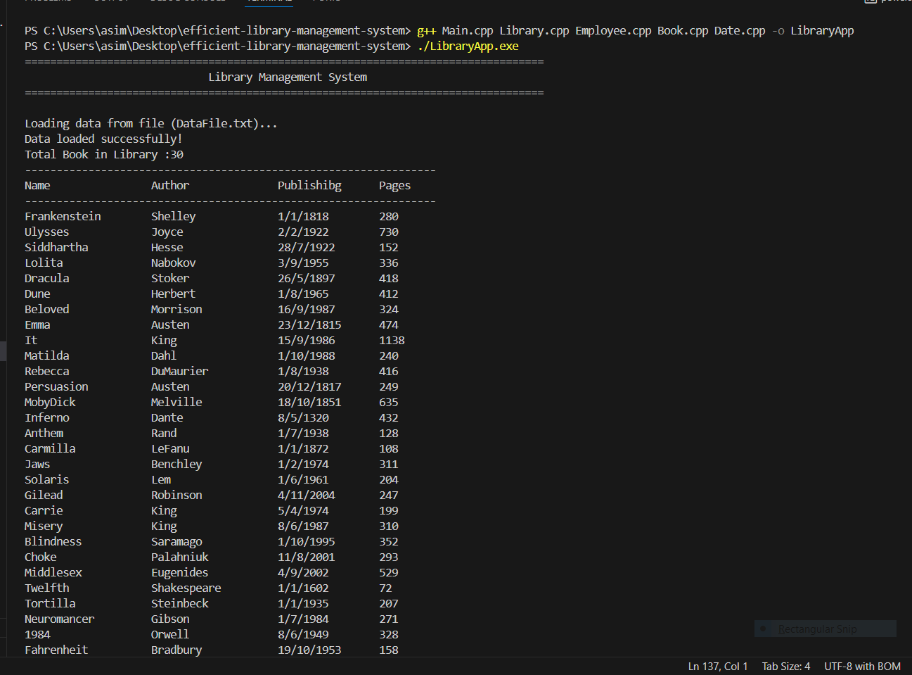
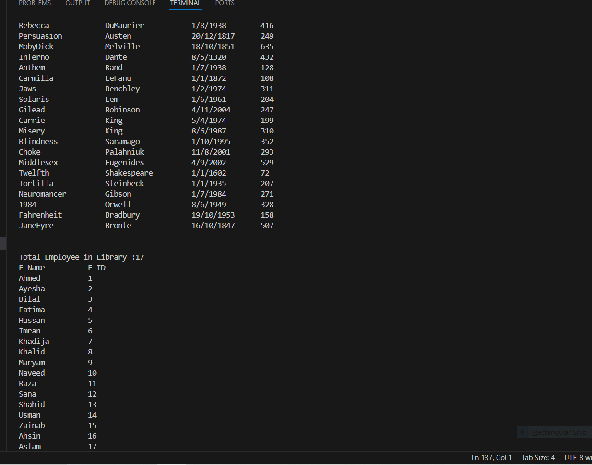
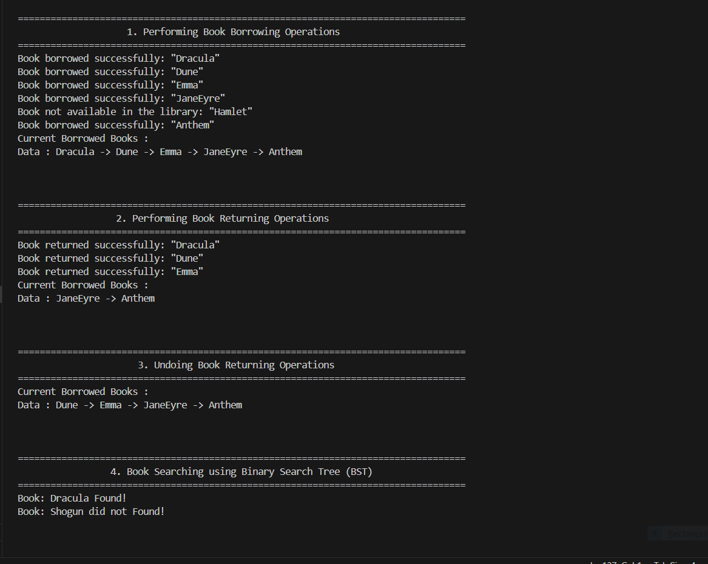
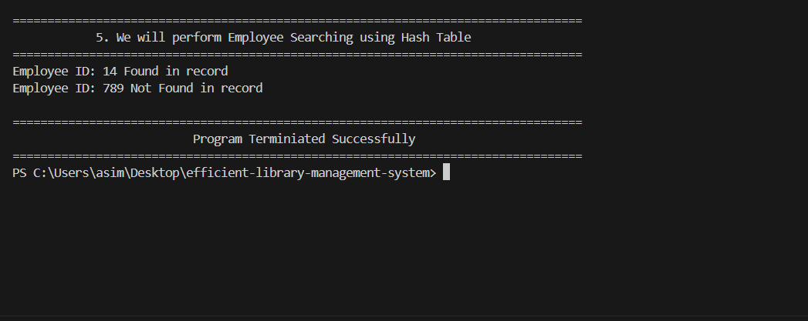

# 📚 Efficient Library Management System (ELMS)

An advanced **C++ project** demonstrating the integration of **Object-Oriented Programming (OOP)** principles with multiple **data structures** such as **Stack, Queue, Linked List, Hash Table, and Binary Search Tree (BST)**.  

ELMS manages essential library operations like book borrowing/returning, searching, and employee management efficiently. It also showcases templates, file handling, and exception handling — making it suitable for both **academic learning** and **practical use**.

---

## 📑 Table of Contents
1. [Features](#-features)  
2. [Technologies & Concepts](#-technologies--concepts)  
3. [How to Run](#-how-to-run)  
4. [Folder Structure](#-folder-structure)  
5. [Sample Output](#-sample-output)  
6. [Exception Handling](#-exception-handling)  
7. [Documentation](#-documentation)  
8. [License & Disclaimer](#-license--disclaimer)  
9. [Conclusion](#-conclusion)  
10. [Author](#-author)  

---

## ✨ Features
- OOP concepts: **Composition, Encapsulation, Abstraction**  
- Book borrowing & returning handled with **Queue**  
- Overdue and undo/redo functionality with **Stack**  
- Fast book searching via **Binary Search Tree (BST)**  
- Employee record management using **Hash Table**  
- Data persistence via **file handling** (`DataFile.txt`)  
- Robust **exception handling** for safe operations  
- Use of **templates** for generic implementations  
- User-friendly **console interface** with structured output  

---

## 🛠 Technologies & Concepts
- **Language:** C++ (C++11/14 compatible)  
- **OOP Principles:** Abstraction, Encapsulation, Composition  
- **Data Structures:** Stack, Queue, Linked List, Hash Table, BST  
- **Other Concepts:** Templates, File Handling, Exception Handling  

---

## ⚙️ How to Run

### 1️⃣ Clone the Repository
```bash
git clone https://github.com/Muneeb-techpro/efficient-library-management-system.git
cd efficient-library-management-system/src
```

### 2️⃣ Compile the Project
```bash
g++ *.cpp -o LibraryApp
```

### 3️⃣ Run the Executable
- Linux / macOS
```bash
./LibraryApp
```

- Windows (PowerShell / CMD)

```bash
LibraryApp.exe
```

---

## 📂 Folder Structure

efficient-library-management-system/
│
├── data/
│   └── DataFile_backup.txt        # Backup copy of input data
│
├── docs/
│   ├── Library_Management_System_Documentation.docx
│   └── Library_Management_System_Documentation.pdf
│
├── media/
│   ├── 01_Code_Overview.mp4
│   └── 02_Execution_and_Testing.mp4
│
├── output/
│   ├── 01_output.png
│   ├── 02_output.png
│   ├── 03_output.png
│   └── 04_output.png
│
├── src/
│   ├── Book.cpp
│   ├── Book.h
│   ├── BST.h
│   ├── BST.tpp
│   ├── DataFile.txt               # Main working data file
│   ├── Date.cpp
│   ├── Date.h
│   ├── Employee.cpp
│   ├── Employee.h
│   ├── HashTable.h
│   ├── HashTable.tpp
│   ├── Library.cpp
│   ├── Library.h
│   ├── LinkedList.h
│   ├── LinkedList.tpp
│   ├── Main.cpp
│   ├── Queue.h
│   ├── Queue.tpp
│   ├── Stack.h
│   └── Stack.tpp
│
└── README.md

---

## Sample Output

**Figure 1: Program start screen**  
  

**Figure 2: Data successfully loaded**  
  

**Figure 3: Borrowing operations**  
  

**Figure 4: Employee search results**  
  

**Text Output Example:**  
See `output/program_output.txt` for the full console output in readable format.

---

## ⚡ Exception Handling

The project includes handling for:
- Missing `DataFile.txt`  
- Invalid book/employee IDs  
- Queue underflow/overflow in borrowing/returning  
- Stack underflow in undo operations  

---

## 📚 Documentation
Detailed documentation (class structure, diagrams, and usage guides) can be found here:  

- 👉 [ELMS Project Documentation (Docx)](/docs/Library_Management_System_Documentation.docx)
- 👉 [ELMS Project Documentation (PDF)](/docs/Library_Management_System_Documentation.pdf)

---

## 📜 License & Disclaimer

- This project is provided for **educational purposes only**.  
- Data in `DataFile.txt` is dummy data for testing and demonstration purposes.  
  
---


## ✅ Conclusion

The Efficient Library Management System (ELMS) demonstrates how advanced data structures and OOP principles can be combined to build a robust, extensible, and efficient C++ application.
It serves as both a functional library system and a learning resource for students & developers.

---

## 👨‍💻 Author

Muneeb Hussain
📌 GitHub: [Muneeb-techpro](https://github.com/Muneeb-techpro)
